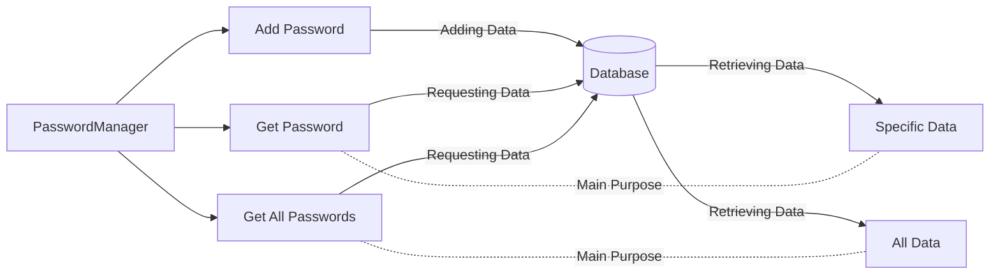
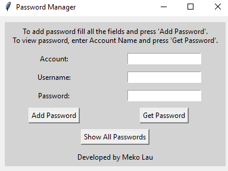
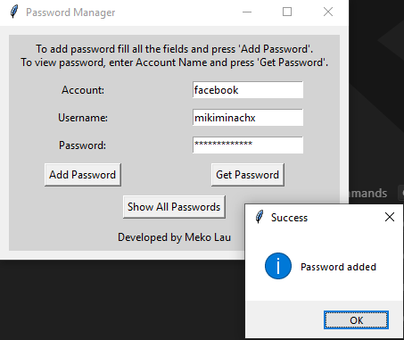
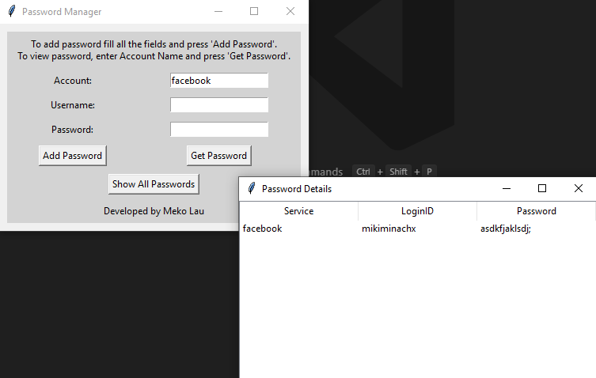
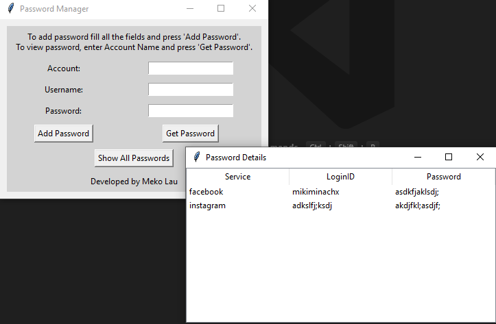

# PasswordManager
PasswordManager is a password manager allows users to store their passwords in their own databases.
<br></br>
A simple flowchart of how PasswordManager works:

## Table of Contents
- [Features](#Features)
- [Quick Start](#Quick-Start)
- [Tutorial](#Tutorial)
- [About the data](#About-the-data)
- [References](#References)
## Features
- The data will be stored locally
- Search for existing enquires
- Easy to use
- Exception handling

**Database Schema:**

| Keys               	| Data Type     	|
|--------------------	|---------------	|
| service            	| TEXT NOT NULL 	|
| loginid            	| TEXT NOT NULL 	|
| encrypted_password 	| TEXT NOT NULL 	|


## Quick Start
### Step 1: Installation
Clone this repository to the local folder by running the following command to your terminal:
```
git clone https://github.com/mikiminachx/pw-manager.git
cd pw-manager
```
Or you can download the releases and unzip it.
<br></br>
Next, if you do not have the packages used in this application, you can simply install them by using this command:
```
pip install -r requirements.txt
```
### Step 2: Start the application
Start the application by running the following command:
```
# Either python or python3, depends on which version of python you have installed to your computer.
python main.py
```
## Tutorial
1. Introduction
After running the ``` main.py ```, the Password Manager application will pop out and show ``` Account ```, ``` Username ```, ``` Password ``` and 3 buttons (``` Add Password ```, ``` Get Password ```, and ``` Show All Passwords ```).
<br></br>

2. Adding Password
For example, you enter the username and password of which website to the application. After that, you click on the ``` Add Password ``` button. The confirmation of adding password will be showed. Like this:
<br></br>

3. Retrieving Password
Get the Password from the **_specific_** website, such as Facebook. You enter "Facebook" into the ``` Account ``` box, then click on ``` Get Password ```. The username and password of that **_specific_** website will be retrieved from the database.

<br></br>
4. Retrieving all the information
What if you forget all the account information of every site? You can just simply click the ``` Get All Passwords ``` button. The database will automatically retrieve every information you entered.

<br></br>
## About the data
The password itself will be encrypted when you store it. When you want to retrieve it, it will be decrypted. The data you stored will be kept in the database. The database is created by SQLite3, which means the keys are stored in the local computer instead of uploading to anywhere online. Of course, the developer myself does not have any access to the users' databases.
## References
- [How to Build a Password Manager in Python](https://thepythoncode.com/article/build-a-password-manager-in-python)
- [Using Python to Build a Password Manager](https://medium.com/@bikumandlasatwik/using-python-to-build-a-password-manager-66fcf1829081)
